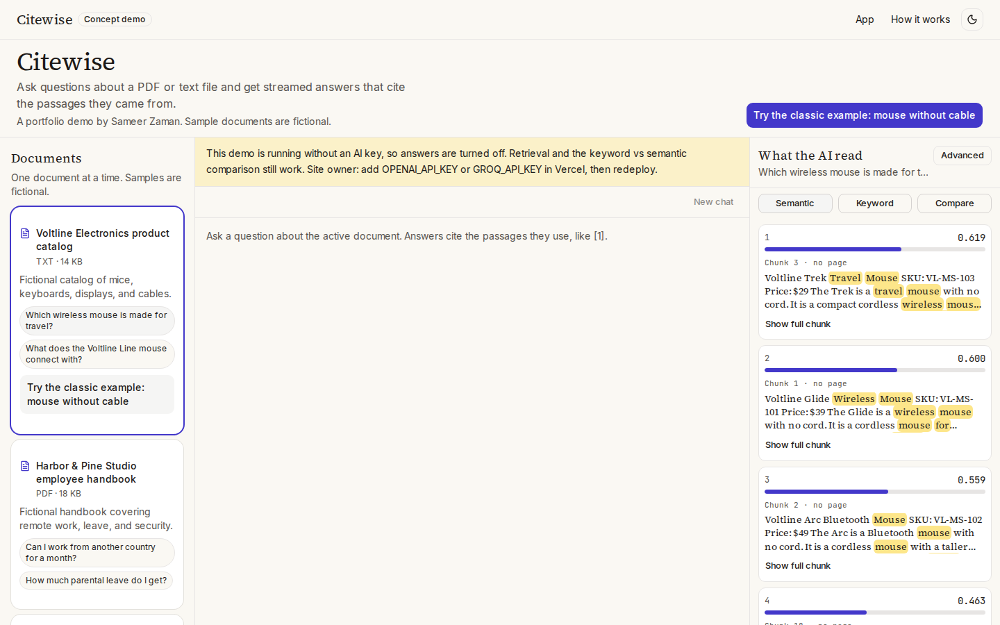
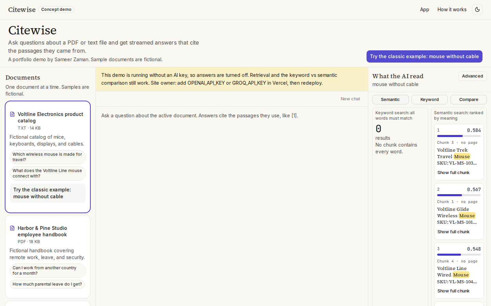
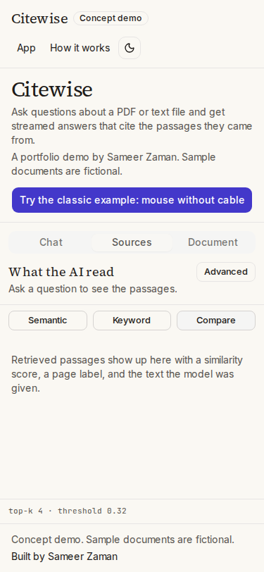
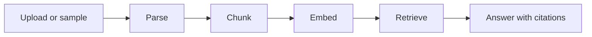

# Citewise: chat with your documents (concept demo)

Ask a PDF or text file a question and get a streamed answer that cites the passages it came from, with the similarity scores beside them.

**Portfolio concept project by Sameer Zaman. Sample documents and companies are fictional.**

**Live demo:** [LIVE_DEMO_URL](LIVE_DEMO_URL)

<!-- TODO: replace after deploy -->





Screenshots are produced by `pnpm screenshots`.

## How it works



A file is parsed in memory, split into passages, and embedded. The question is embedded the same way. Citewise keeps the closest passages above a score threshold and asks the model to answer only from those passages, citing them as [1] or [2]. If nothing clears the threshold, the model is not called.

Keyword search on "mouse without cable" needs every word in one passage, so the Voltline catalog returns 0 hits: the wireless mice never say "without" or "cable". Semantic search matches meaning, so those same mice rank first. The score you see is the cosine similarity from the model that is configured, not a fixed demo number.

## Features

- Three fictional samples, plus PDF, TXT, and MD upload (4 MB, 50 pages, 200,000 characters)
- Chunking with page numbers, about 800 characters per passage, and overlap only when a long passage is split
- Browser embeddings with MiniLM, or OpenAI embeddings when a key is set
- Retrieval panel with real scores, score bars, cited badges, and a top-k slider
- Keyword, semantic, and compare views, including the mouse example with no chat key
- Streamed answers with citation chips when a chat key is set, and a fixed not-found reply when the document does not say
- Light and dark theme, and a phone layout with Chat, Sources, and Document tabs
- Per-IP rate limits, with Upstash when it is configured

## Tech stack

Next.js App Router, React 19, TypeScript, Tailwind CSS v4, shadcn/ui, Vercel AI SDK 7, unpdf, and Transformers.js. Tests use Vitest and Playwright.

## Provider setup

OpenAI only: set `OPENAI_API_KEY`. Chat uses `gpt-5-mini` unless `LLM_MODEL` is set, and embeddings use `text-embedding-3-small`.

Groq for chat, browser for embeddings: set `GROQ_API_KEY`. Chat defaults to `openai/gpt-oss-20b`. Embeddings stay in the browser because Groq is not used for vectors here.

No keys at all: the app still builds and deploys. Sample documents index in the browser, the retrieval panel works, and the mouse comparison works. The chat input is disabled and explains how to add a key.

## Environment variables

| Name | Required | Example | Notes |
|---|---|---|---|
| `LLM_PROVIDER` | No | `openai` or `groq` | Auto-detected from keys if unset |
| `OPENAI_API_KEY` | One of the two keys for chat | `sk-...` | Also enables server embeddings |
| `GROQ_API_KEY` | One of the two keys for chat | `gsk_...` | Chat only |
| `LLM_MODEL` | No | `gpt-5-mini` | Defaults per provider |
| `EMBEDDING_PROVIDER` | No | `openai` or `browser` | OpenAI when that key exists, otherwise browser |
| `EMBEDDING_MODEL` | No | `text-embedding-3-small` | OpenAI embeddings only |
| `UPSTASH_REDIS_REST_URL` | No | `https://xxx.upstash.io` | Shared rate limits and the daily cap |
| `UPSTASH_REDIS_REST_TOKEN` | No | | Pair with the URL |
| `RATE_LIMIT_CHAT_PER_10MIN` | No | `20` | |
| `RATE_LIMIT_INGEST_PER_10MIN` | No | `6` | |
| `RATE_LIMIT_EMBED_PER_10MIN` | No | `60` | |
| `DAILY_REQUEST_CAP` | No | `500` | Needs Upstash. Counts chat requests per day |
| `NEXT_PUBLIC_SITE_URL` | Yes in production | `https://citewise-demo.vercel.app` | Metadata and the sitemap |

With no Upstash credentials, limits use an in-memory map on each server instance. That is best effort: a second instance has its own window. Upstash shares the window and turns on the daily cap.

Embedding one sample with OpenAI costs a fraction of a cent. Set a monthly spending limit in the OpenAI or Groq dashboard before you publish the URL.

## Getting started

```bash
pnpm install
pnpm dev
```

`pnpm install` copies the ONNX wasm files the browser model needs into `public/ort`. Open http://localhost:3000, load a sample, and try "mouse without cable". `pnpm test` runs the unit tests. `pnpm test:e2e` and `pnpm screenshots` need a production build first (`pnpm build`) and a Chromium install (`pnpm exec playwright install chromium`).

## Deploy on Vercel

1. Import the repo. The framework is Next.js. Install command is `pnpm install`. Node 24 is set in `engines`.
2. Leave the keys empty for a retrieval-only demo, or add `OPENAI_API_KEY` or `GROQ_API_KEY`.
3. Set `NEXT_PUBLIC_SITE_URL` to the deployment URL.
4. Optional: add Upstash Redis from the Vercel Marketplace and copy `UPSTASH_REDIS_REST_URL` and `UPSTASH_REDIS_REST_TOKEN` into the project env.
5. Deploy. With no model key, the banner explains that answers are off and retrieval still works.

## Limitations

Uploads live in the browser session and are not stored. There is one document at a time, no accounts, and no OCR for scanned pages. A production version keeps vectors in a database such as Postgres with pgvector, signs people in, re-indexes when a file changes, searches more than one document, and checks answers against an evaluation set.

## Credit

Built by [Sameer Zaman](https://sameer-zaman.vercel.app), available for RAG chatbot and AI search work.
